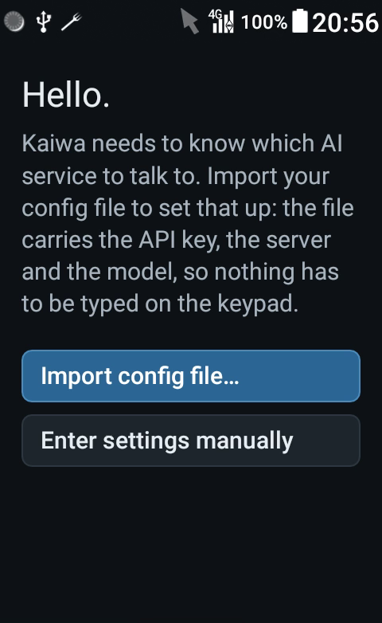
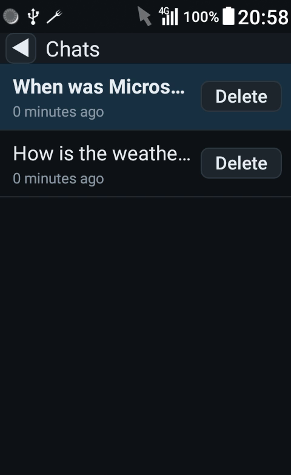
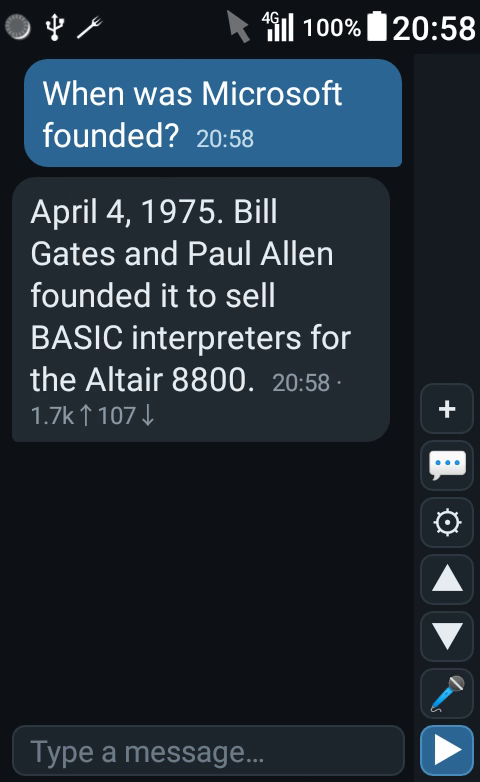
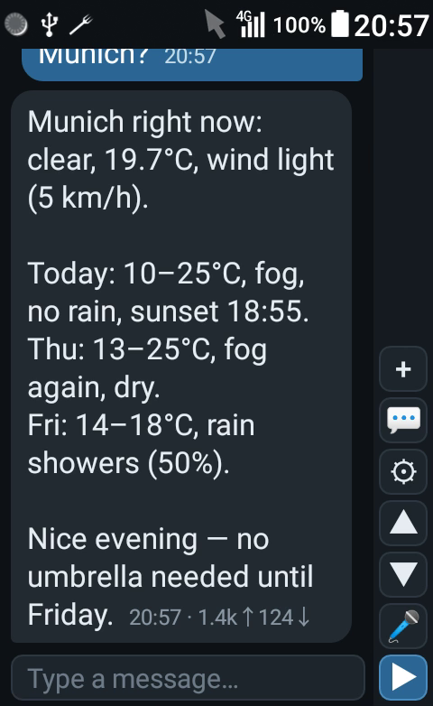
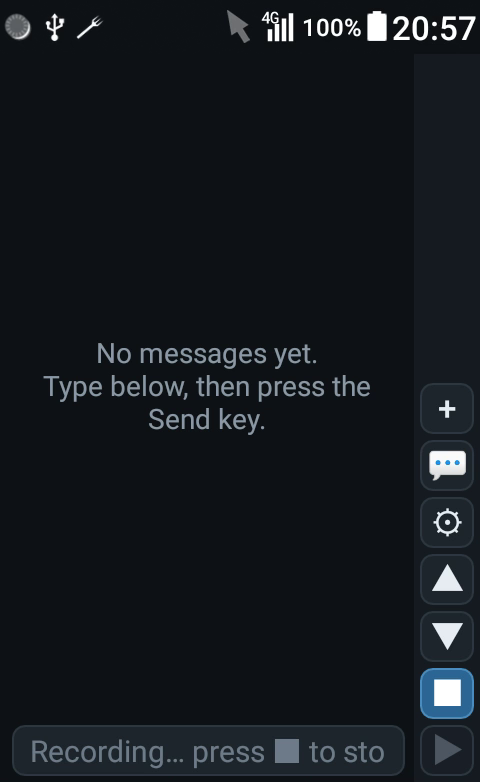

# Kaiwa

A **keypad-first** AI chat app for Android phones **without a touchscreen**. It was made for
the **KYOCERA NP902KC**, a Japanese Android 8.1 flip phone, and runs on current Android as
well. It talks to any **OpenAI-compatible** API - **DeepSeek** by default.

<p>
  
  
</p>

*On the NP902KC: the first run and the chat list. The chat itself is under
[The chat screen](#the-chat-screen).*

## Features

- **Built for a keypad** - every screen is driven by the D-pad, centre and SEND keys; nothing
  needs a touch.
- **Chats** - as many as you like, each named after its first message.
- **Voice input** - 🎤 records, a speech-to-text service transcribes, and the words are sent
  at once. Self-hosted ([faster-whisper-setup](https://github.com/mogeldev/faster-whisper-setup))
  or a hosted service such as OpenAI, Groq or Mistral.
- **Tools** - the model can look up the weather, air quality and pollen, or a Wikipedia
  summary. No keys needed, and off until you switch them on.
- **Date and time** go with every question, so "today" and "tonight" mean something.
- **Time on every message, cost on every reply** - `07:52 · 586↑2↓` shows the tokens in and
  out.
- **Set up by file** - one JSON file imported from the phone's storage, so a long API key never
  has to be typed on a keypad.
- **Any OpenAI-compatible API** - DeepSeek, OpenAI, Azure OpenAI, OpenRouter, or a local
  Ollama or LM Studio.
- **Small** - an APK under 3 MB, no networking or JSON libraries, no storage permission.

## Install

1. Download `kaiwa-X.Y.apk` from the [latest release](https://github.com/mogeldev/kaiwa/releases/latest).
2. Install it: allow installing from unknown sources for the app you open it with, or from a
   PC with `adb install -r kaiwa-X.Y.apk`.
3. Updates install straight over the previous version; chats and settings are kept.

You also need an **API key** from an OpenAI-compatible provider - or none, for a local server
on your network.

**On the NP902KC:**

- On install the phone asks whether to lift the app's data restriction: answer **Yes**.
  Otherwise every connection fails at once, although the phone shows it is online.
- Switch the **virtual cursor** off. While it is on, the D-pad moves a pointer instead of the
  focus, and the app looks frozen.

## First run

Until an API key is set, Kaiwa opens on a welcome screen with two buttons:

- **Import config file…** - the easy way; see [Configuration file](#configuration-file).
- **Enter settings manually** - the API form: key, base URL, model and system prompt.

Once a key is set - or a local `http://` server is allowed without one - the chat opens.

## The chat screen

<p>
  
  
  
</p>

*A quick answer, the weather tool, and voice input while recording.*

The sidebar holds every action: **+** new chat, **💬** chat list, **⚙** Settings, **▲/▼**
scroll, **🎤** record (**■** while recording), **▶** send. Your messages are blue on the right,
replies grey on the left. Wherever the focus is, the control turns blue.

| Where | Key | Does |
| --- | --- | --- |
| chat screen | SEND | sends; while recording, stops and transcribes |
| message box | `ENTER`, centre | sends |
| message box | `UP` | goes to **+** |
| message box | `DOWN` | goes to ▶ - or ■ while recording, ▼ while a reply is on its way |
| message box | `LEFT`, `RIGHT` | move the caret |
| sidebar | `0`-`9`, `*`, `#` | back to the message box (that press is not typed) |
| chat screen | `MENU`, where the phone has one | opens Settings |
| chat list | `UP`, `DOWN` | row to row |
| chat list | `RIGHT`, `LEFT` | into and out of the row's Delete |
| API form | `UP`, `DOWN` | leave a field from its first or last line |
| API form | SEND | Test connection |

SEND does nothing anywhere else, rather than opening the phone's dialer.

Replies come whole, not streamed: on a slow phone a pause is kinder than a screen that keeps
repainting.

## Configuration file

Every setting can come from one JSON file. [`config.example.json`](config.example.json) lists
every field.

### Importing

1. Write the file on a PC and copy it to the phone, for example with
   `adb push config.json /sdcard/Download/config.json`.
2. Choose **⚙ → Import config…** (or **Import config file…** on the welcome screen) and pick the
   file.
3. A report shows the model, server, whether a key is set, the voice endpoint, the tools and
   every field that was applied.

- The app sees only the one file you pick; it has no storage permission. Files over 256 KB are
  refused.
- **Delete the file from the phone afterwards** - it holds your API key.
- Importing never touches your chats. Import and the API form write the same settings; the
  later change wins.

### Rules

- **Partial files are fine.** Fields that are left out keep their current value, so
  `{"model": "deepseek-v4-pro"}` is a complete config.
- **`null` restores the default** - `"model": null` gives back `deepseek-flash`. For a scheme
  (`auth.scheme`, a voice block's `scheme`), `null` means no scheme.
- **All or nothing.** A file with one invalid value changes nothing, and the report says why.
- **Unknown fields are ignored**, so a config written for a newer version still imports.
- **`http://` needs `"allowCleartext": true`** - plain HTTP is refused otherwise.
- Whole-number fields (`version`, the timeouts) take `90` or `"90"`, but not `1.9` or `true`.

### Fields

| Field | Default | Notes |
| --- | --- | --- |
| `version` | `1` | Anything else is rejected |
| `baseUrl` | `https://api.deepseek.com` | Must start with `http://` or `https://` |
| `model` | `deepseek-flash` | Cannot be blank |
| `apiKey` | `""` | Blank only for an `http://` server with `allowCleartext` |
| `systemPrompt` | a prompt for short replies | Date and time are added to it; `""` sends none |
| `auth.header` | `Authorization` | Azure wants `api-key` |
| `auth.scheme` | `Bearer` | `""` sends the bare key, as Azure wants |
| `headers` | `{}` | Extra request headers |
| `query` | `{}` | Extra URL parameters, e.g. Azure's `api-version` |
| `body` | `{}` | Extra request fields, e.g. DeepSeek's `thinking` |
| `chatPath` | `/chat/completions` | May be an absolute URL |
| `modelsPath` | `/models` | Used by Test connection |
| `temperature` | not sent | 0-2 |
| `maxTokens` | not sent | 1-200000, sent as `max_tokens` |
| `timeoutSeconds` | `90` | 5-600; raise it for a slow local model or long thinking |
| `allowCleartext` | `false` | Required for any `http://` endpoint |
| `tools` | `[]` | See [Tools](#tools) |
| `transcribeUse`, `transcribe`, `transcribeCloud` | | See [Voice input](#voice-input) |

### DeepSeek

`deepseek-flash` thinks before it answers. `config.example.json` switches that on with
`"body": {"thinking": {"type": "enabled"}}`; `"disabled"` gives faster, cheaper replies.

- Thinking counts as output, so keep `maxTokens` generous - the example uses `65536`. A small
  limit cuts the answer off or leaves it empty.
- `temperature` has no effect while thinking.
- Thinking takes time: raise `timeoutSeconds` if hard questions run out of it (the example
  waits 180 seconds).

DeepSeek retired `deepseek-chat` and `deepseek-reasoner` on 2026-07-24. Kaiwa replaces either
name with `deepseek-flash`, thinking on and `maxTokens` 65536 - in an imported file and in
settings stored by an older version - so an old config keeps working.

### Examples

**Local Ollama or LM Studio** - plain `http://`, no key, a longer timeout:

```json
{
  "version": 1,
  "baseUrl": "http://192.168.1.50:11434/v1",
  "model": "llama3.2",
  "apiKey": "",
  "allowCleartext": true,
  "timeoutSeconds": 180
}
```

**OpenAI**

```json
{ "version": 1, "baseUrl": "https://api.openai.com/v1", "model": "gpt-4.1-mini", "apiKey": "sk-..." }
```

**Azure OpenAI** - the key in its own header without a scheme, the API version in the query:

```json
{
  "version": 1,
  "baseUrl": "https://myres.openai.azure.com/openai/deployments/gpt-4o",
  "model": "gpt-4o",
  "apiKey": "...",
  "auth": { "header": "api-key", "scheme": "" },
  "query": { "api-version": "2024-10-21" }
}
```

**OpenRouter** - with attribution headers:

```json
{
  "version": 1,
  "baseUrl": "https://openrouter.ai/api/v1",
  "model": "anthropic/claude-sonnet-4",
  "apiKey": "sk-or-...",
  "headers": { "HTTP-Referer": "https://example.com", "X-Title": "Kaiwa" }
}
```

### When something goes wrong

- Errors show the server's own reason, plus a hint for the usual causes (wrong key, no
  credit, unknown model, too many requests, server trouble).
- A **redirect** is reported with its target instead of being followed - put that address in
  the config.

## Chats

- **Switch** with 💬, **create** with **+**, **delete** with the row's Delete and a
  confirmation.
- A chat is named after its first message; until then it is "New chat".
- A chat keeps its **last 40 messages**, and those are what the model sees. A new topic
  belongs in a new chat.
- A reply that arrives after you switched chats lands in the chat that asked.
- A chat takes **one question at a time**: while its reply is on its way it shows
  **Thinking…**, and other chats stay free to use.

## Tools

List them in the config to switch them on, e.g. `"tools": ["weather", "air_quality",
"wikipedia"]`:

| Tool | Source | Answers with |
| --- | --- | --- |
| `weather` | Open-Meteo | now, three days ahead, sunrise and sunset, UV |
| `air_quality` | Open-Meteo | European AQI, PM2.5, PM10, pollen |
| `wikipedia` | Wikipedia in the phone's language | the opening section of the best match |

- No keys needed. Open-Meteo is free for non-commercial use.
- Off by default, because a provider without tool support may reject requests that carry them.
- The tools only read; none writes, sends or deletes anything.
- Place names work best as the city calls itself or in English: `München` or `Munich`.

## Voice input

```
🎤  ->  speak  ->  ■ or SEND  ->  transcribed  ->  sent as your message
```

- 🎤 starts, **■** or SEND stops. A recording stops itself after five minutes, and leaving the
  screen discards it.
- The first press asks for microphone access.
- There is no review step: on a keypad, saying a sentence again beats editing it.
- Silence sends nothing.

Two endpoints can be stored side by side; `transcribeUse` picks the one the mic uses:

| `transcribeUse` | Block | For |
| --- | --- | --- |
| `selfhosted` (default) | `transcribe` | your own [faster-whisper-setup](https://github.com/mogeldev/faster-whisper-setup) server |
| `cloud` | `transcribeCloud` | a hosted service: OpenAI, Groq, Mistral |

Each block keeps its own settings and key, so `{"transcribeUse": "cloud"}` alone switches over.
With `cloud`, your recordings go to that provider.

### Self-hosted voice

[faster-whisper-setup](https://github.com/mogeldev/faster-whisper-setup) runs Whisper on your
own server - CPU only, behind an API key and a TLS proxy - so recordings never leave your
hands. Its install script generates the key into the server's `.env`. Kaiwa's `transcribe`
defaults already match its API, so the config needs only the address and that key:

```json
{
  "version": 1,
  "transcribeUse": "selfhosted",
  "transcribe": {
    "baseUrl": "https://whisper.example.com",
    "apiKey": "API_KEY-from-the-server's-.env"
  }
}
```

- A CPU server needs a while per request, so keep the default `timeoutSeconds` of 300.
- On your own network without TLS, a plain `http://` address also works with
  `"allowCleartext": true`.

| Field | `transcribe` | `transcribeCloud` | Notes |
| --- | --- | --- | --- |
| `baseUrl` | not set | not set | Blank switches the endpoint off |
| `apiKey` | `""` | `""` | Optional for a server on your network |
| `path` | `/v2/transcribe` | `/audio/transcriptions` | May be an absolute URL |
| `header` | `X-API-Key` | `Authorization` | `""` sends no key |
| `scheme` | `""` | `Bearer` | |
| `field` | `audio` | `file` | The form field the recording goes in |
| `form` | `{}` | `{}` | Extra form fields, e.g. the model |
| `timeoutSeconds` | `300` | `120` | 5-1800 |

Hosted services need a model in `form`:

| Provider | `baseUrl` | `form` |
| --- | --- | --- |
| OpenAI | `https://api.openai.com/v1` | `{"model": "gpt-4o-mini-transcribe"}` |
| Groq | `https://api.groq.com/openai/v1` | `{"model": "whisper-large-v3-turbo"}` |
| Mistral | `https://api.mistral.ai/v1` | `{"model": "voxtral-mini-latest"}` |

`"language": "de"` (or your language) in `form` helps accuracy and speed. Services with their
own protocol - Deepgram, Google, AssemblyAI - are not supported. Recordings are AAC in `.m4a`,
16 kHz mono: five minutes stay under 1.5 MB.

## Settings

**⚙** (or `MENU`) opens three rows:

- **Import config…** - see [Configuration file](#configuration-file).
- **API settings** - key, base URL, model and system prompt. **Test connection** (or SEND)
  checks the key and lists the models you can use. Only **Save** stores the form; Back leaves
  the settings as they were.
- **About** - the version.

## Privacy

- Your questions, the chat history and the system prompt go to the chat API you configured;
  recordings go to the transcription endpoint you configured.
- Tool lookups send the place or search term to Open-Meteo or Wikipedia.
- Nothing else leaves the phone: no analytics, no account.
- Chats and settings, API keys included, are stored in the app's private storage. A device
  backup can include them.

## Build from source

Requirements: JDK 17 or newer (Android Studio's bundled JDK works) and the Android SDK with
`compileSdk 37` and build-tools 37.0.0. Gradle comes with the wrapper.

```
./gradlew :app:assembleDebug        # gradlew.bat on Windows
adb install -r app/build/outputs/apk/debug/app-debug.apk
```

- The debug build is `com.kaiwa.chat.debug` and installs next to the release, with its own
  chats and settings.
- `:app:assembleRelease` builds an unsigned APK. To sign it, put a `keystore.properties` at the
  repository root with `storeFile`, `storePassword`, `keyAlias` and `keyPassword`; both it and
  the keystore are ignored by git.
- The APKs on the releases page are signed with a key that is not in this repository. A build
  signed with your own key cannot update an installed release: uninstall that first, which
  deletes its chats and settings.

Target versions: minSdk 27 (Android 8.1), targetSdk 36. No native code, no third-party
networking or JSON libraries - `HttpURLConnection` and `org.json` only.

## License

[MIT](LICENSE)
